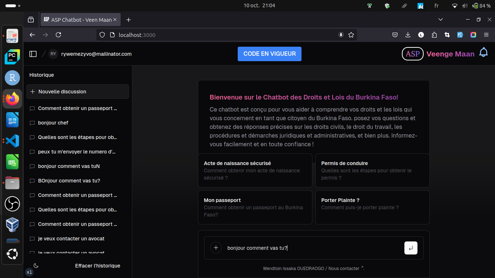

<a href="https://chat.vercel.ai/">


<h1 align="center">VEENGE MAAN CHATBOT</h1>
</a>

## Exécution locale

Pour exécuter le projet localement, suivez ces étapes :

1. Créez un fichier `.env.local` et ajoutez l'URL de l'API de votre backend.
2. Installez les dépendances :
   ```bash
   pnpm install
   ```
3. Lancez le projet :
```bash
  pnpm run dev
```
Votre application devrait maintenant être accessible à l'adresse localhost:3000.

## Fonctionnalités
  - Utilise Next.js pour le routage et le rendu côté serveur
  - Composants du serveur React (RSC), Suspense, et actions du serveur pour une gestion optimale des requêtes
  - Prise en charge des modèles IA personnalisés, entraînés sur les données des services publics du Bénin
  - Tailwind CSS pour le style et la mise en page
  - Icônes fournies par Phosphor Icons
  - Historique des conversations et stockage des sessions avec une base de données personnalisée
  - Authentification avec NextAuth.js

