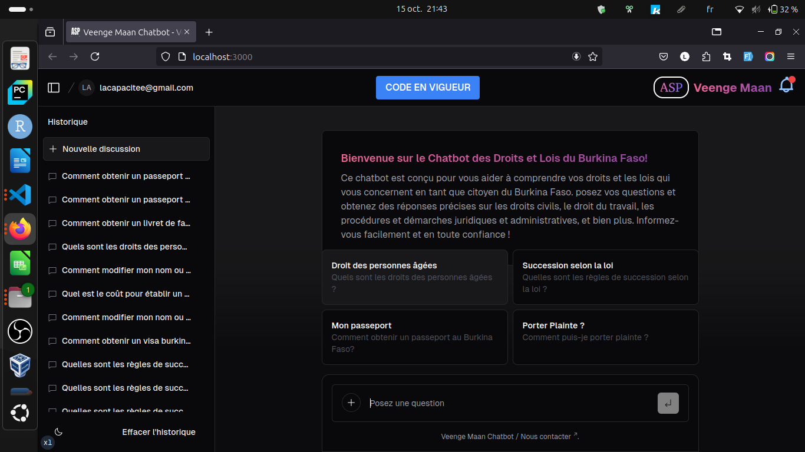

<a href="https://chat.vercel.ai/">

<h1 align="center">VEENGE MAAN CHATBOT</h1>
</a>

<a href="#fonctionnalités"><strong>Fonctionnalités</strong></a> ·
<a href="#modèles-dapprentissage"><strong>Modèles d'apprentissage</strong></a> ·
<a href="#déploiement"><strong>Déploiement</strong></a> ·
<a href="#exécution-locale"><strong>Exécution locale</strong></a> ·
<a href="#auteurs"><strong>Auteurs</strong></a>

 

## Fonctionnalités

- [Next.js](https://nextjs.org) pour le routage et le rendu côté serveur
- Composants du serveur React (RSC), Suspense, et actions du serveur pour une gestion optimale des requêtes
- Prise en charge des modèles IA personnalisés, entraînés sur les données des services publics du Bénin
- [Tailwind CSS](https://tailwindcss.com) pour le style et la mise en page
- Icônes fournies par [Phosphor Icons](https://phosphoricons.com)
- Historique des conversations et stockage des sessions avec une base de données personnalisée
- Authentification avec [NextAuth.js](https://github.com/nextauthjs/next-auth)

## Modèles d'apprentissage

Le projet utilise un modèle IA personnalisé, entraîné sur un ensemble de données provenant des services publics du Bénin. Ce modèle a été conçu pour répondre aux questions spécifiques sur les services publics, fournir des informations à jour, et améliorer l'accès aux services gouvernementaux.

Vous pouvez également intégrer d'autres fournisseurs de modèles ou ajuster le modèle actuel pour répondre à des besoins spécifiques.

## Déploiement

## Exécution locale

Pour exécuter l'assistant de service public localement, vous devrez utiliser les variables d'environnement définies dans .env.example. Il est recommandé d'utiliser [Vercel Environment Variables](https://vercel.com/docs/projects/environment-variables) pour gérer ces variables, mais un fichier .env est suffisant pour le développement local.

> *Remarque* : Ne commitez pas votre fichier .env, car il contient des informations sensibles.

1. Installez Vercel CLI : npm i -g vercel
2. Liez l'instance locale à votre projet Vercel : vercel link
3. Téléchargez vos variables d'environnement : vercel env pull

bash
npm install
npm run dev

Votre application devrait maintenant être accessible à l'adresse [localhost:3000](http://localhost:3000/).

* *Membres de l'équipe* :
  * **[OUEDRAOGO WENDTOIN ISSAKA]( https://www.linkedin.com/in/wendtoinissaka)** - Contributeur, Burkina Faso
 

 